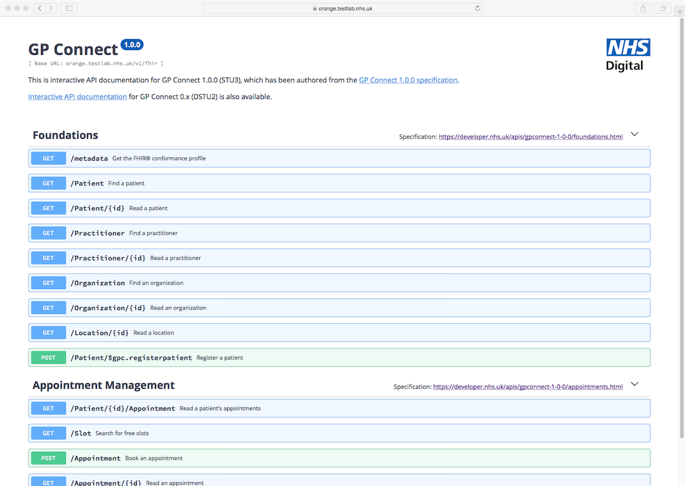

# Swagger UI for GP Connect

This is the repository for the Swagger UI for GP Connect.

## Try it online

- <a href="https://orange.testlab.nhs.uk/swagger/v0">Swagger UI for GP Connect 0.7.x - Access Record HTML</a>
- <a href="https://orange.testlab.nhs.uk/swagger/v1/appointments">Swagger UI for GP Connect 1.2.x - Appointment Management/ Foundations</a>
- <a href="https://orange.testlab.nhs.uk/swagger/v1/structured">Swagger UI for GP Connect 1.2.x - Access Record Structured</a>
- <a href="https://orange.testlab.nhs.uk/swagger/v1-5/structured">Swagger UI for GP Connect 1.5.x - Access Record Structured</a>
- <a href="https://orange.testlab.nhs.uk/swagger/v1-5/documents">Swagger UI for GP Connect 1.5.x - Access Document</a>

## Screenshot

